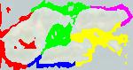

Graff Mathieu   
Choffat Rémi   
Babachanakh Kateryna   
Vaultrin Maxime   

# Rapport projet IA

## Introduction
L'objectif de la SAÉ est d'identifier les différents biomes d'une planètes et les rassembler en cluster pour différencier plusieurs écosystèmes sur l'image. Il faudra donc passer par plusieurs étapes afin d'arriver à notre objectif : 
 - [Prétraitement de l'image](#prétraitement-de-limage)
 - [Détection et visualisation des biomes](#détection-et-visualisation-des-biomes)
 - [Détection et affichage des écosystèmes pour chaque biome](#détection-et-affichage-des-écosystèmes-pour-chaque-biome)
## Prétraitement de l'image
Avant d'effectuer les calculs sur l'image, il faut la traiter. Pour cela, on va appliquer un flou qui permettra d'avoir une image plus homogène avec des couleurs plus semblables. Les clusters seront donc plus denses.    
Pour appliquer un flou, on a implémenter deux techniques :
 - le flou par moyenne
 - le flou gaussien   
Le flou par moyenne utilise un filtre carré en 3x3. Chaque pixel va donc prendre la moyenne de couleur de tous ses voisins.   
Le flou gaussien utilise des filtres précalculés en 3x3, 5x5 ou 7x7. Les coefficients sont plus élevés au centre et faibles aux extrémités. La moyenne du pixel est calculée à partir du filtre.

## Détection et visualisation des biomes
Chaque pixel de l'image floutée est ensuite parcouru et comparé avec une palette de couleur qui défini chaque biome. Un pixel appartiendra au biome dont la couleur est la plus proche d'une palette.   
Les pixels obtenus sont stockés puis envoyés aux algorithmes de clustering pour définir les écosystèmes.

## Détection et affichage des écosystèmes pour chaque biome
Une fois le biome récupéré, on va envoyer les points récupérés dans un algorithme qui va former des cluster représentant des écosystèmes sur la planète.   
On a implémenté plusieurs algorithmes afin de tester leur efficacité et leur vitesse : 
- KMeans
- DBScan
- HCA
    - Single linkage
    - Centroïd linkage

### KMeans
Pour implémenter cet algorithme, on va placer des centroïdes aléatoirement entre les points. Chaque centroïde va représenter un cluster qui inclura tous les points les plus proches de lui. Ensuite, on va calculer le barycentre de chaque cluster et y placer leur centroïde. On va ensuite recalculer les cluster en fonctions des points proches des centroïdes. On va répéter ces opérations un certain nombre de fois.
### DBScan
Pour trouver un cluster avec DBScan, on va trouver la densité du cluster en définissant un rayon de voisinage epsilon. On va aussi définir un nombre de points minimum dans le rayon qui va définir si un point est un core point. Tous les core points qui sont adjacents à d'autres feront parti du même cluster. Un cluster contient aussi des border points qui sont des points n'ayant pas le nombre minimum de points dans leur rayon mais qui font parti de celui d'un autre. Il y a des points qui n'appartiennent à aucun cluster, ce sont les noise points.
### HAC
Dans cet algorithme, tous les points représentent un cluster. Ensuite on va utiliser une méthode de calcul pour déterminer si un cluster est proche d'un autre. On va donc utiliser ce calcul sur tous les clusters et fusionner ceux qui sont les plus proches. On va répéter cet algorithme jusqu'à avoir le nombre de cluster voulu.  
Pour calculer la distance entre les clusters, on a utilisé plusieurs méthodes : 
- Single linkage
- Centroid linkage   
En single linkage, pour calculer la distance entre les clusters, on prend les points les plus proches entre les clusters et on calcule leur distance.   
En centroid linkage, on calcule le barycentre de chaque cluster et on calcule ensuite la distance entre les barycentres de chaque cluster.

## Comparaison des algorithmes

### Image de la planète

### Forêt tempérée   

### KMeans   

   

### DBScan   

   

### HAC Single   

   

### HAC Centroid   

   

### Eau peu profonde

### KMeans

### DBScan

### HAC Single

### HAC Centroid   

### Glacier

### KMeans

### DBScan

### HAC Single

### HAC Centroid

## Conclusion
On peut voir que chaque algorithme a des résultats différents en fonction de la disposition des biomes et de leur densité. KMeans est le plus rapide mais la disposition aléatoire se voit surtout sur les gros clusters et nécessite d'être relancé plusieurs fois pour avoir un résultat satisfaisant.   
Avec DBScan on peut voir que quand les clusters sont écartés, il y a souvent trop de clusters différents mais quand les clusters sont très denses, les résultats sont très précis mais un peu plus longs à calculer que KMeans.   
HAC est lui beaucoup plus long à calculer que les autres mais donne des résultats précis en fonction de la méthode de calcul utilisée. On a donc dû réduire la résolution des images pour avoir un résultat plus rapide. On peut voir que le single linkage est plus efficace quand les clusters sont larges et denses. Le centroid linkage lui est plus efficace quand les clusters sont arrondis et éloignés les uns des autres.
